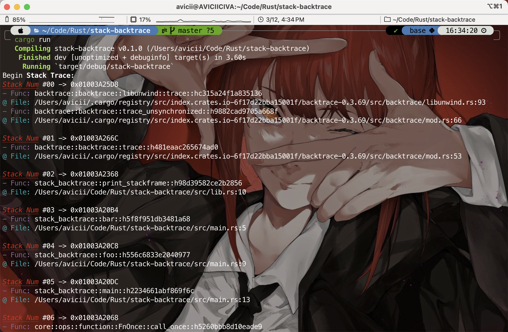

# :trophy: Stack-Backtrace

## 开发环境

+ ARM 架构, MacOS 操作系统.
+ Rust Crate `backtrace`.

## 功能实现

+ 在 **用户态** 下获取函数调用栈帧的 **指令指针**, 对应的 **函数名** 与 **文件名和行号**.
+ 使用 Crate `backtrace` 提供的系列函数可以获得当前的函数调用情况.

### `fn trace<F: FnMut(&Frame) -> bool>(cb: F)`

+ 将当前所有活动帧 `frames: Frame` 传递到提供的闭包 `cb` 中.
+ 以自顶向下的方式生成帧, 跟踪的程序堆栈情况.

### `fn resolve<F: FnMut(&Symbol)>(addr: *mut c_void, cb: F)`

+ 将指令指针 `ip` 转换为包含函数名称和文件名、行号的 `Symbol` 对象.
+ 将 `Symbol` 对象传递给提供的闭包 `cb` 中.

## 实现代码

```rust
/* lib.rs */
use backtrace::{resolve, trace};
use colored::*;

pub fn print_stackframe() {
    print!("Begin {}", "Stack Trace:".bold());
    let mut frame_cnt = 0;
    trace(|frame| {
        let ip = frame.ip();
        println!("\n{} #{:<02} -> {:#03$X}",
            "Stack Num".red().italic().underline(), frame_cnt, ip as usize, 12
        );
        frame_cnt += 1;

        resolve(ip, |symbol| {
            if let Some(name) = symbol.name() {
                println!("{} {}",
                    "- Func:".magenta(), name
                );
            }
            if let Some(file) = symbol.filename() {
                if let Some(l) = symbol.lineno() {
                    println!("{} {}:{}",
                        "@ File:".cyan(), file.display(), l
                    );
                }
            }
        });
        true
    });
}
```

## 运行结果

编写测试代码:

```rust
/* main.rs */
use stack_backtrace::print_stackframe;

fn bar() {
    print_stackframe()
}

fn foo() {
    bar()
}

fn main() {
    foo();
}
```

运行得到相应结果:



## 参考资料

主要参考了 [Rust Crate `backtrace` Doc.](https://docs.rs/backtrace/latest/backtrace/index.html)
